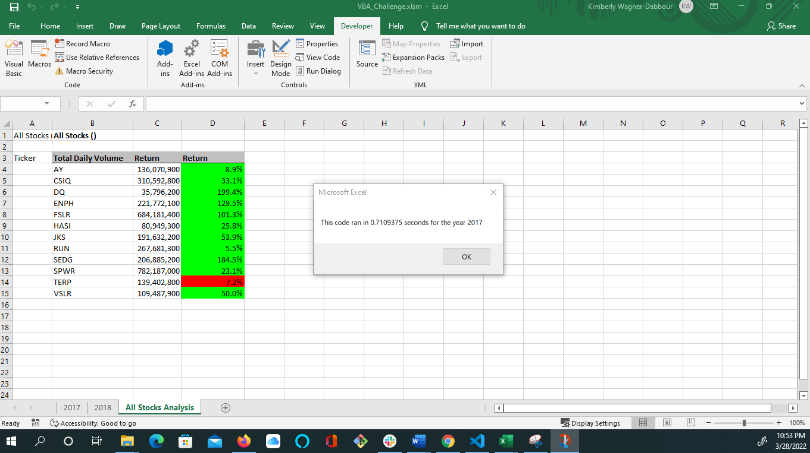
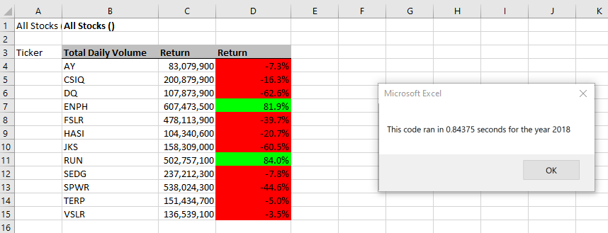

# Stock Analysis Refactored

## **Overview:** 
Refactoring our stock analysis code to run through all stocks in our dataset.

## **Purpose:**
To determine if refactoring our code loop through the stock data will make it run faster. In addition, what advantage & disadvantages may happen through refactoring the code. 

# **Results**
**Graphics for Run Times on the Refactored VBA code**

1. Create a ticker Index, set to 0
        
        For i = 0 To 11
        tickerIndex = tickers(i)

2. Array created for tickers, tickerVolumes, tickerStartingPrices, and tickerEndingPrices
    
    Dim tickerVolumes As Long
    Dim tickerStartingPrices As Single, tickerEndingPrices As Single
       
3. The tickerIndex is used to access the stock ticker index for the tickers, tickerVolumes, tickerStartingPrices, and tickerEndingPrices arrays
    
       Worksheets(yearValue).Activate
       tickerVolumes = 0
       
       For j = 2 To RowCount
           
           'If the next row's ticker doesn't match, increase the tickerIndex.
           If Cells(j, 1).Value = tickerIndex Then
           
              'Increase volume for current ticker
              tickerVolumes = tickerVolumes + Cells(j, 8).Value
      
           End If
           
4.The script loops through stock data, reading and storing all of the following values from each row:'tickers, tickerVolumes, tickerStartingPrices, and tickerEndingPrices
        
           If Cells(j - 1, 1).Value <> tickerIndex And Cells(j, 1).Value = tickerIndex Then

               'Store Starting Price Value
               tickerStartingPrices = Cells(j, 6).Value
               
           End If

           If Cells(j + 1, 1).Value <> tickerIndex And Cells(j, 1).Value = tickerIndex Then

               'Store Ending Price Value
               tickerEndingPrices = Cells(j, 6).Value
           End If
       Next j
        
5. Code for formatting the cells in the spreadsheet is working.

           Worksheets("All Stocks Analysis").Activate
           
           Cells(4 + i, 2).Value = tickerIndex
           Cells(4 + i, 3).Value = tickerVolumes
           Cells(4 + i, 4).Value = tickerEndingPrices / tickerStartingPrices - 1
    
            'Fix % on return
            With Range("D4:D15")
                        .NumberFormat = "0.0%"
                        .Value = .Value
            End With

# Summary:
**1. What are the advantages or disadvantages of refactoring code?**

**Advantages:** 
- Improves the design look of the code, making it easier to understand.
- Makes it easier to find and trouble shoot errors.
- Often makes the code run faster.

**Disadvantages:**
- Cleaning up code can be extremely time consuming, and when possible, should be done in small steps and tested. 
- Could drive costs of a project up due to the amount of time needed to make changes.
- Changes could effect the testing outcomes.

**2.  How do these pros and cons apply to refactoring the original VBA script?**

When refactoring the orginal VBA script, it took almost twice as long as it did it did to write the codes originally.  However, once all codes were cleaned up, errors were easier to spot and correct.  The functionality remained the same, however, the code had fewer steps, there by using less memory and improve understanding for future analysis to use. 

