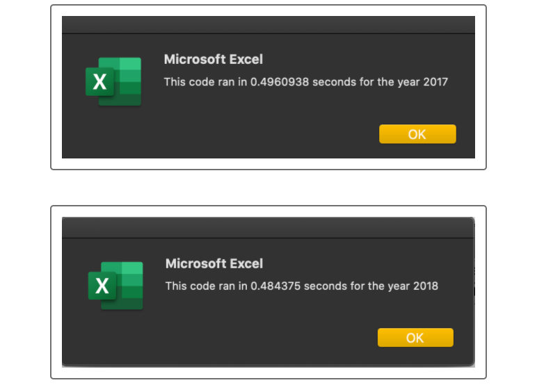

# Stock Analysis Refactored

## Overview of Project: Refactoring our stock analysis code to run through all stocks in our data set

### Purpose: To determine if refactoring our code loop through the stock data will make it run faster. In addition, what advantage & disadvantages may happen through refactoring the code. 

## Results
### 

## Summary
### 1. What are the advantage and disadvantages to refactoring code?
Advantages:
Disadvantages:
### 2.  Advantages and Disadvantages found in this analysis of the refactored code.
