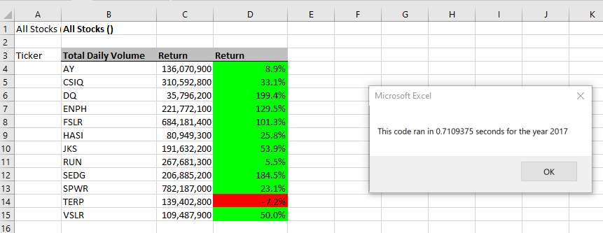

# Stock Analysis Refactored

## Overview of Project: Refactoring our stock analysis code to run through all stocks in our data set.

### Purpose: To determine if refactoring our code loop through the stock data will make it run faster. In addition, what advantage & disadvantages may happen through refactoring the code. 

# Results
### 

# Summary
## 1. What are the advantages or disadvantages of refactoring code?
###**Advantages:** 
- Improves the design look of the code, making it easier to understand.
- Makes it easier to find and trouble shoot errors.
- Often makes the code run faster.
###**Disadvantages:**
- Cleaning up code can be extremely time consuming, and when possible, should be done in small steps and tested. 
- Could drive costs of a project up due to the amount of time needed to make changes.
- Changes could effect the testing outcomes.

### 2.  How do these pros and cons apply to refactoring the original VBA script?

